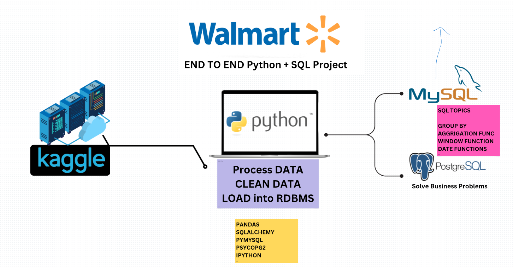

# Walmart Sales Forecasting & Retail Data Analysis

An end-to-end retail analytics and sales forecasting project built using Python, SQL, and machine learning techniques. This project focuses on Walmart sales data analysis, business intelligence, data preprocessing, feature engineering, and forecasting workflows using real-world retail datasets.

---

## Project Overview

This project demonstrates:

- Data cleaning and preprocessing
- Exploratory Data Analysis (EDA)
- SQL-based business problem solving
- Retail sales trend analysis
- Data visualization
- Machine learning workflows
- Business insights generation

The project uses Walmart retail sales data to analyze customer behavior, transaction patterns, payment methods, sales trends, and operational insights.

---

## Tech Stack

### Programming & Analysis
- Python
- Jupyter Notebook
- Pandas
- NumPy
- Matplotlib
- Seaborn

### Database & Querying
- MySQL
- PostgreSQL
- SQL

### Machine Learning
- Scikit-learn
- XGBoost

---

## Repository Structure

```bash
Walmart-Sales-Forecasting/
│
├── data/
│   ├── raw/
│   └── processed/
│
├── notebooks/
│
├── sql/
│
├── reports/
│
├── images/
│
├── README.md
├── LICENSE
└── .gitignore
```

---

## Dataset Information

The dataset contains Walmart retail transaction and sales data including:

- Branch information
- Product categories
- Payment methods
- Revenue and sales records
- Customer ratings
- Transaction timestamps
- City and branch-level information

---

## Business Problems Solved

This project addresses multiple business intelligence problems including:

- Payment method analysis
- Branch-wise sales trends
- Customer rating analysis
- Revenue analysis
- Category performance analysis
- Peak sales period detection
- Sales shift analysis
- Profitability analysis

Detailed problem statements are available in:

```bash
reports/business_problems.pdf
```

---

## Machine Learning Workflow

The project includes:

1. Data preprocessing
2. Feature engineering
3. Data visualization
4. Regression modeling
5. Forecasting analysis
6. Performance evaluation

---

## SQL Analysis

The repository contains:
- MySQL query solutions
- PostgreSQL query solutions
- Aggregation queries
- Window functions
- Business analytics queries

SQL scripts are available in:

```bash
sql/
```

---

## Project Architecture



---

## Future Improvements

- Interactive dashboard integration
- Streamlit web application
- Automated ETL pipelines
- Advanced forecasting models
- Cloud deployment
- Docker containerization
- GitHub Codespaces support

---

## Author

Shraman Kumar

---

## License

This project is licensed under the MIT License.
